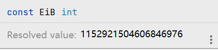

# 3 Basic Data Types

Go 的数据类型分四大类：

* 基础类型：数值、字符串和布尔型
* 复合类型：数组、结构体
* 引用类型：指针、切片、映射（map）、函数以及通道
* 接口类型

### 3.1 整数

Go 的数值类型包括了几种不同大小的整数、浮点数和复数。

int 和 uint 是在特定机器上位数最合理或运算效率最高的有符号和无符号数值类型，具体大小和编译器以及处理器位数有关。rune 是 int32 的同义词，两者可互换使用，通常用于 Unicode 码点。类似地，byte 是 int8 的同义词。（💡 但不可互换使用）

uintptr 是一个无符号整数类型，它的大小不明确，但能够完整存放一个指针的值。uintptr 仅仅用于底层编程，例如在与 C 程序库或操作系统进行交互时。

位运算：

* &：交（AND）
* |：并（OR）
* ^：作为二元运算符时为XOR，作为一元运算符时为按位取反
* &^：位清空（AND NOT），a &^ b 即在 a 的数值基础上进行运算，将对应 b 二进制位为 1 的位设为 0
* <<：左移
* \>>：右移

左移以0填补右边空位，无符号整数右移同样以0填补左边空位，但**有符号数的右移操作是按符号位的值填补空位**。因此，对有符号数进行右移操作时需要谨慎处理。

当以无符号数作为迭代变量递减时也需要留意，当其为0之后再递减会变为其类型的最大值。因此 len 函数虽然不会返回一个负数，但其返回值类型仍然选择了有符号数。因此，无符号数仅用在如实现位集、解析二进制文件或散列加密等需要用到位运算或特殊数学运算的场景。

任何大小和类型的整数字面量都能写成十进制数；八进制数以 0 开头，如 0666；十六进制数以 0x 或 0X 开头，如 0x1a，大小写均可。

```go
o := 0666
fmt.Printf("%d %[1]o %#[1]o\n", o) // 438 666 0666
x := 0x7fffffffffffffff
fmt.Printf("%d %[1]x %#[1]x %#[1]X\n", x)
// 9223372036854775807 7fffffffffffffff 0x7fffffffffffffff 0X7FFFFFFFFFFFFFFF
```

\[1] 代表复用第 1 个操作数，# 代表输出前缀。

### 3.2 浮点数

_float32 的正浮点数表示范围大约为 1.4e-45 \~ 3.4e38，float64 的正浮点数表示范围大约为 4.9e-324 \~  1.8e308。_十进制下，float32 的有效数字大约是 6 位，float64 的有效数字大约是 15 位。

```go
fmt.Printf("%8.3f\n", f)
```

按个字符宽度输出，保留3位有效小数。

### 3.3 复数

在代码中，如果在浮点数或十进制整数后写上字母i，如 3.14i 或 2i，它就变成了一个实部为 0 的虚数。复数的声明可以简写为：

```go
x := 1 + 2i
```

### 3.4 布尔值

布尔值无法隐式转换成数值。

### 3.5 字符串

字符串是不可变的字节序列。字符串可以通过比较运算符做比较，如 == 和 <；比较运算符按字节进行。

不可变意味着两个字符串能安全地共用一段底层内存，使得复制任何长度字符串的开销都低廉。图 3.4 展示了一个字符串及两个子字符串的内存布局，它们公用底层字节数组。

<figure><figcaption><p>3.4 "hello, world" 及其两个子串</p></figcaption></figure>

#### 3.5.1 字符串字面量

在字面量字符串中也可以用十六进制或八进制转义字符来包含任意字节。十六进制的转义字符写作 \xhh，h为十六进制数且必须为两位；八进制转义字符写作 \ooo，每个o代表一个八进制数，不超过 \377。这两者都表示单个字节。

原始字符串字面量写作 \`...\` ，其中不能包含转义字符，显式格式和在源码中的格式一致，可以展开到多行。

#### 3.5.2 Unicode

Unicode 囊括了世界上所有文书体系的全部字符，以及重音符和其他变音符，控制码，以及许多特有文字，对它们各自赋予一个叫 Unicode 码点的标准数字。在 Go 中，也称为一个 rune。天然适合保存单个文字符号的数据类型是 int32，rune 类型位 int32 类型的别名。

将文字符号序列表示成 int32 值序列的方式称为 UTF-32 或 UCS-4。

#### 3.5.3 UTF-8

UTF-8 以字节位单位对 Unicode 码点作变长编码。UTF-8 现在是 UTF-8 标准。用 1\~4 个字节来表示每一个 rune。

<figure><figcaption><p>UTF-8 编码</p></figcaption></figure>

由于 UTF-8 对信息进行了变长编码，所以无法对编码后的字符串通过索引直接访问第n个字符。但它紧凑、兼容 ASCII、自同步（self synchronization）：最多向前找三个字节就能找到一个编码的开头。前缀编码使其解码不会产生歧义。

> In [coding theory](https://en.wikipedia.org/wiki/Coding\_theory), especially in [telecommunications](https://en.wikipedia.org/wiki/Telecommunication), a self-synchronizing code is a [uniquely decodable code](https://en.wikipedia.org/wiki/Uniquely\_decodable\_code) in which the [symbol](https://en.wikipedia.org/wiki/Symbol\_\(data\)) stream formed by a portion of one [code word](https://en.wikipedia.org/wiki/Code\_word), or by the overlapped portion of any two adjacent code words, is not a valid code word.
>
> [https://en.wikipedia.org/wiki/Self-synchronizing\_code](https://en.wikipedia.org/wiki/Self-synchronizing\_code)
>
> 💡 一个编码的一部分或任意两个编码的重叠部分不是一个有效的编码。UTF-8编码中，如果字节以0开为ASCII，110开头的编码占有两个字节，1110开头占三个字节，11110开头占四个字节。10开头则代表是某个编码的其中一个字节。从编码后数据的任意部分开始都能够有效地解码出后续的信息，则称为自同步。

Go 源文件总是以 UTF-8 编码，Go 程序操作文本字符串时也倾向于 UTF-8 编码。下面几个字符串字面量都表示长度为6字节的相同串：

```go
"世界"
"\xe4\xb8\x96\xe7\x95\x8c" \\ UTF8编码，同时也是在内存中的数值
"\u4e16\u754c" \\ 2字节unicode编码
"\U00004e16\U0000754c" \\ 4字节unicode编码
```

码点小于256的 rune 可以用单个十六进制转义符来表示，如 'A' 写作 '\x41'，但对于更大的值，必须使用 \u 或者 \U 转义符。（用到 \U 形式的情况比较少）因此，'\xe4\xb8\x96' 不是一个合法的 rune 字面量。

"Hello, 世界" 的内存布局如图3.5。它有13个字节，按 UTF-8 本质是9个码点或 rune。可以用 unicode/utf8 包中的解码器来处理这些字符，也**可以用 range 循环按 UTF-8 隐式解码**。💡 用 for 循环取下标遍历字符串获取到的是一个字节。

<figure><figcaption><p>3.5 Hello，世界内存布局</p></figcaption></figure>

当 UTF-8 编码字符串用 \[]rune 转换时，返回字符串对应的 unicode 码点序列（💡 可以由 string 和 \[]rune 可以互相类型转换推断，string 类型的底层类型是一个 rune 数组）：

```go
s := "プログラム"
fmt.Printf("% x\n", s) // e3 83 97 e3 83 ad e3 82 b0 e3 83 a9 e3 83 a0
r := []rune(s)
fmt.Printf("%x\n", r) // [30d7 30ed 30b0 30e9 30e0]
fmt.Println(string(r)) // プログラム
```

动词 `% x` 在每个数之间插入了一个空格。

将一个整数转换为字符串时，将其视作一个 rune 值，生成对应 UTF-8 中对应的表示：

```go
fmt.Println(string(65)) // "A" 而不是 "65"
fmt.Println(0x4eac) // "京"
```

如果 rune 值非法，将被专门的替换字符取代。（💡 go 1.17中 将数值转换为string并不能通过）            &#x20;

#### 3.5.4 字符串与字节切片

4个标准包对字符串操作特别重要：bytes, strings, strconv, unicode。

#### 3.5.5 字符串和数值的相互转换

**数值转字符串**

* fmt.Sprintf(format string, a ...interface{}) string // 可以灵活地指定输出格式
* strconv.Itoa(i int) string
* strconv.FormatInt(i int64, base int) string

**字符串转数值**

* strconv.Atoi(s string) (**int**, error) // Atoi is equivalent to ParseInt(s, 10, 0), converted to type int.
* strconv.ParseInt(s string, base int, bitSize int) (**i int64**, err error)

### 3.6 常量

常量是一种表达式，在编译时而不是运行时就能保证定值，从而使编译器得以知晓其值。所有常量本质上都属于基本类型：布尔型、字符串或数字。

对于常量操作数，所有数学运算、逻辑运算和比较运算的结果及类型转换结果同样为常量，某些内置函数的返回值也是常量，如 len, cap, real, imag, complex 和 unsafe.Sizeof。

若同时声明一组常量，除了第一项之外，其他项在等号右侧的表达式都可以省略：

```go
const (
    a = 1
    b
    c = 2
    d
)
fmt.Println(a, b, c, d) // 1 1 2 2
```

#### 3.6.1 常量生成器 iota

```go
type Weekday int
const (
    Sunday Weekday = iota // 0
    Monday // 1
    Tuesday // 2
    Wednesday // 3
    Thursday // 4
    Friday // 5
    Saturday // 6
)
```

```go
type Flags uint
const (
    FlagUp Flags = 1 << iota // 1
    FlagBroadcast // 2
    FlagloopBack // 4
    FlagPointToPoint // 8
    FlagMulticast // 16
)
const a = iota // 0
const b = iota // 0
```

💡 只有连续声明才会递增

#### 3.6.2 无类型常量

许多常量并没有指定具体类型，编译器将这些从属类型待定的常量表示成某些值，**这些值比基本类型的数字精度更高，且算数精度高于原生的机器精度**。你可以假设他们至少有256位的精度。共有六种：无类型布尔、无类型整数、无类型 rune、无类型浮点数、无类型复数、无类型字符串。

```go
const (
    _ = 1 << (10 * iota)
    KiB
    MiB
    GiB
    TiB
    PiB
    EiB
    ZiB (1 << 70)
    YiB (1 << 80)
)
```

ZiB 和 YiB 的值无法存储在任何整型中，但是它们都是合法常量并且可以用在下面的表达式中：

```go
fmt.Println(YiB/ZiB) // 1024
fmt.Println(ZiB / 1024) // 1152921504606846976
```

💡 但是当计算值大于最大的能表示的数时无法直接输出：

```go
fmt.Println(ZiB / (1 << 7)) // constant 9223372036854775808 overflows int（1在第64位）
fmt.Println(ZiB/(1<<7) - 1) // 9223372036854775807
```

💡 默认表示类型为 int，所以可能以 int 为参照判断溢出。



只有常量才可以是无类型的。在能够隐式转换的前提下，当无类型常量赋值到变量，如下方第一个语句，或出现在具有明确类型的变量声明的右方，如其他三个语句，常量被隐式转换到了变量的类型。

```go
var f float64 = 3+0i // untyped complex -> float64
f = 2 // untyped integer -> float64
f = 1e123 // untyped floating-point -> float64
f = 'a' // untyped rune -> float64
```
